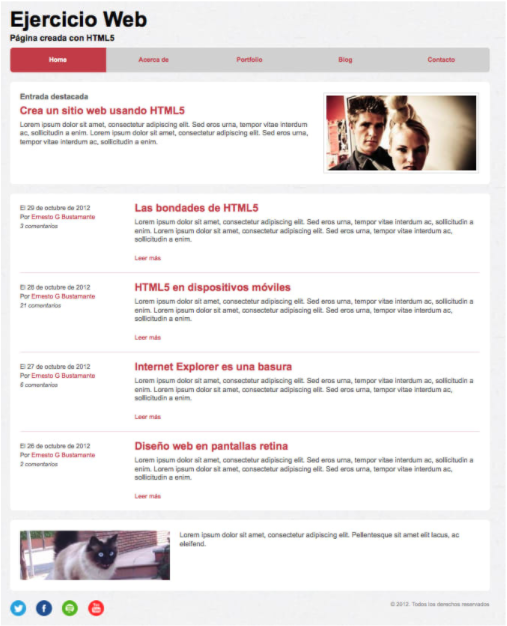

# Frontend exercise

## Overview

This image resembles a basic website. You will need basic understanding of HTML and CSS in order to achieve this.

## Goals

1. Replicate the website 

## Specifications

The replica must be as exact as possible, with the correct color and images.

You’re only allowed to use HTML,CSS and JS, you cannot use any 
Framework or libraries.

Milestones are specifications that will be added in the near future.

## Deploy

[https://wilson-romero.github.io/platzimaster-frontend-1/](https://wilson-romero.github.io/platzimaster-frontend-1/)